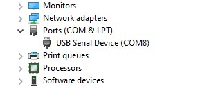
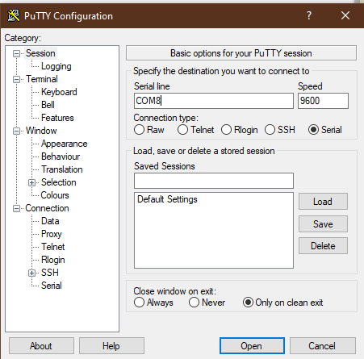

import Tabs from '@theme/Tabs';
import TabItem from '@theme/TabItem';

## Overview

If you are developing ZMK on a device that does not have a built in UART for debugging and log/console output,
Zephyr can be configured to create a USB CDC ACM device and the direct all `printk`, console output, and log
messages to that device instead.

:::warning Battery Life Impact

Enabling logging increases the power usage of your keyboard, and can have a non-trivial impact to your time on battery.
It is recommended to only enable logging when needed, and not leaving it on by default.

:::

## Kconfig

The following KConfig values need to be set, either by copy and pasting into the `app/prj.conf` file, or by running
`west build -t menuconfig` and manually enabling the various settings in that UI.

:::note
If you are debugging your own keyboard in your [user config repository](./user-setup.md), use
`config/boards/shields/<your_keyboard>/<your_keyboard>.conf` instead of `app/prj.conf`. In Github
Actions, you can search the `Kconfig file` build log to verify the options above have been enabled 
for you successfully.
:::

```
# Turn on logging, and set ZMK logging to debug output
CONFIG_LOG=y
CONFIG_ZMK_LOG_LEVEL_DBG=y

# Turn on USB CDC ACM device
CONFIG_USB=y
CONFIG_USB_DEVICE_STACK=y
CONFIG_USB_CDC_ACM=y
CONFIG_USB_CDC_ACM_RINGBUF_SIZE=1024
CONFIG_USB_CDC_ACM_DEVICE_NAME="CDC_ACM"
CONFIG_USB_CDC_ACM_DEVICE_COUNT=1

# Enable serial console
CONFIG_SERIAL=y
CONFIG_CONSOLE=y
CONFIG_UART_INTERRUPT_DRIVEN=y
CONFIG_UART_LINE_CTRL=y

# Enable USB UART, and set the console device
CONFIG_UART_CONSOLE=y
CONFIG_USB_UART_CONSOLE=y
CONFIG_UART_CONSOLE_ON_DEV_NAME="CDC_ACM_0"
CONFIG_USB_UART_DTR_WAIT=n
```

## Viewing Logs

After flashing the updated ZMK image, the board should expose a USB CDC ACM device that you can connect to and view the logs.

<Tabs
defaultValue="linux"
values={[
{label: 'Linux', value: 'linux'},
{label: 'Windows', value: 'win'},
{label: 'MacOS', value: 'macos'}
]}>
<TabItem value="linux">

On Linux, this should be a device like `/dev/ttyACM0` and you can connect with `minicom` or `tio` as usual, e.g.:

```
sudo tio /dev/ttyACM0
```

</TabItem>
<TabItem value="win">

On Windows, you can use [PuTTY](https://www.putty.org/). Once installed, use Device Manager to figure out which COM port your controller is communicating on (listed under 'Ports (COM & LPT)') and specify that as the 'Serial line' in PuTTY.





If you already have the Ardunio IDE installed you can also use its built-in Serial Monitor.

</TabItem>
<TabItem value="macos">

On MacOS, the device name is something like `/dev/tty.usbmodemXXXXX` where `XXXXX` is some numerical ID. 
You can connect to the device with [tio](https://tio.github.io/) (can be installed via [Homebrew](https://formulae.brew.sh/formula/tio)):

```
sudo tio /dev/tty.usbmodem14401
```

You should see tio printing `Disconnected` or `Connected` when you disconnect or reconnect the USB cable. 
</TabItem>
</Tabs>

From there, you should see the various log messages from ZMK and Zephyr, depending on which systems you have set to what log levels.
